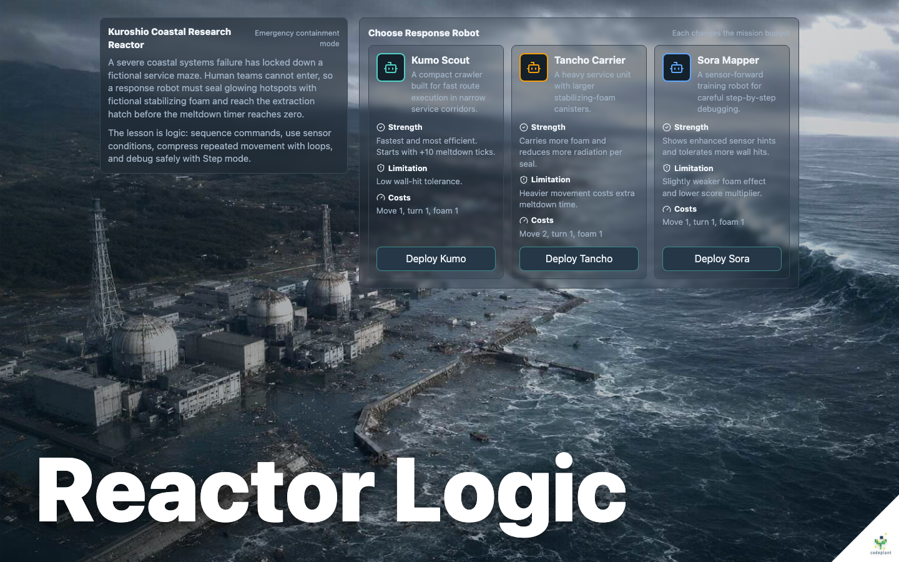
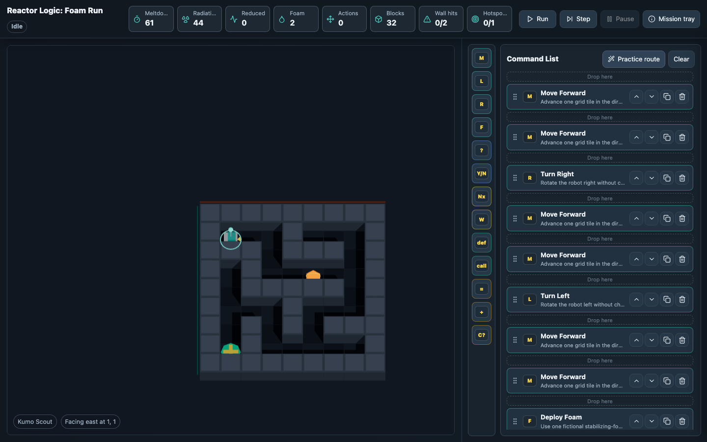
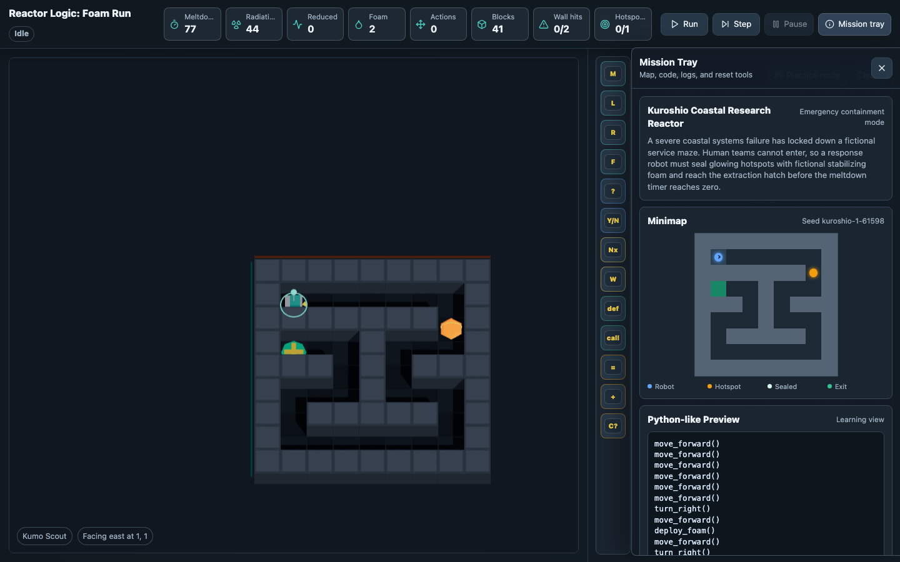

# Reactor Logic: Foam Run

Expandable React, TypeScript, and Three.js browser game prototype for teaching beginner logic and early coding concepts through a fictional disaster-response robot maze.

## Gameplay

Program a response robot through a compromised fictional coastal research reactor maze. The player chooses a robot, assembles command blocks, previews Python-like pseudocode, then runs or steps through the program to seal stabilizing-foam hotspots and reach extraction before the turn-based meltdown timer expires.



The main play view keeps the maze visible on the left and reserves the right panel for the command list and control-module strip. Players can click modules to add commands, drag to reorder, and use the header controls for Run, Step, Pause, and the slide-out mission tray.



The mission tray keeps secondary information out of the core programming panel while still exposing the minimap, pseudocode preview, mission log, score, seed controls, and reset tools.



## Run

```bash
npm install
npm start
```

Open `http://localhost:3000/`.

Useful checks:

```bash
npm run typecheck
npm run build
```

## Cloudflare Pages

This project is configured to build as a static Cloudflare Pages app.

Cloudflare Pages Git settings:

- Framework preset: None / custom
- Install command: `npm ci`
- Build command: `npm run build`
- Build output directory: `dist`

Local Pages preview:

```bash
npm run pages:preview
```

Direct upload deploy with Wrangler:

```bash
npm run cf:whoami
npm run pages:deploy
```

The local `wrangler.jsonc`, `.wrangler/`, `.dev.vars*`, and other Cloudflare/account-specific files are ignored so secrets and deployment-specific settings do not get committed to the public repo. Keep production values in the Cloudflare Pages project settings.

## License

Licensed under the GNU Affero General Public License v3.0 only. This keeps collaboration open: modified versions and network-deployed derivatives must provide corresponding source under the same license. Commercial use is allowed when those copyleft obligations are met; commercial closed-source forks are not permitted by this license.

## Project Shape

- `src/game/mazeGenerator.ts`: seeded maze generation, BFS reachability, par-action estimate, practice-route helper.
- `src/game/interpreter.ts`: block execution, conditions, nested control flow, safety cap, mission success/failure.
- `src/game/blocks.ts`: registry-based block definitions and Python-like pseudocode rendering.
- `src/game/robots.ts`: configurable robot stats and tradeoffs.
- `src/game/scoring.ts`: score and star calculation.
- `src/components/GameScene.tsx`: React Three Fiber maze, camera, robot visuals, hotspots, extraction zone.
- `src/components/*`: HUD, minimap, block palette, program editor, code preview, briefing, robot selection.

## Add A Block

Add an entry in `src/game/blocks.ts` with:

- `type`, `label`, `category`, and `description`
- `createDefaultBlock`
- optional `childSlots`
- `interpreter` metadata
- `toPseudoCode`

Then add execution behavior in `src/game/interpreter.ts` if the block is not a simple primitive or existing control shape. Add the block type to `paletteBlockTypes` to show it in the palette.

## Add A Robot

Add a `RobotConfig` entry in `src/game/robots.ts`. The game state applies movement costs, foam capacity, foam strength, wall-hit tolerance, sensor hints, and score multiplier from that config.

## Tune Levels

Adjust `generateMaze` in `src/game/mazeGenerator.ts` for maze size, hotspot count, radiation values, foam budget, and meltdown timer scaling. The generator uses seeded randomness plus BFS validation so generated hotspots and extraction remain reachable.

The scenario is intentionally fictional and arcade-puzzle focused. Stabilizing foam and the Kuroshio facility are gameplay inventions.
